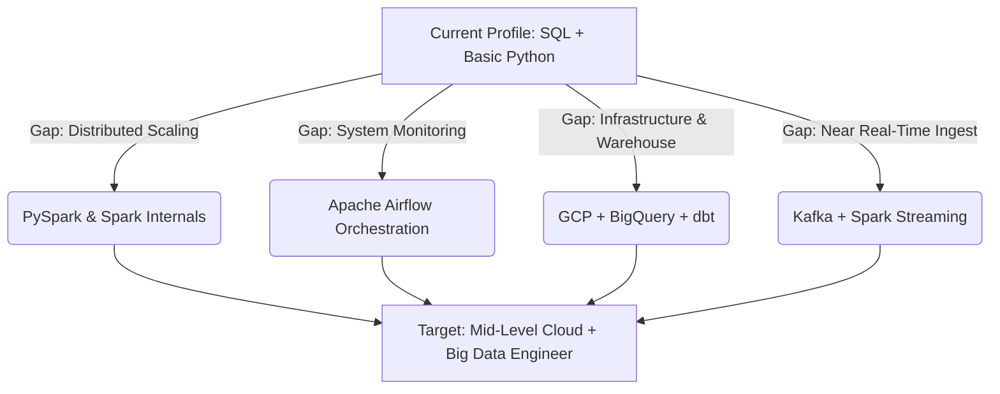

# 🚀 The Ultimate 90-Day Data Engineer Transition Roadmap
*Prepared by: Senior Staff Data Engineer & FAANG Interviewer*  
*Target Date*: June 25, 2026 – September 22, 2026 (90 Days)  
*Candidate Profile*: Ratan (Data Engineer, Equentis Wealth Advisory, ~1 yr 10 mo experience)  
*Goal*: Transition to Mid-Level Cloud + Big Data Engineer in India (Target: 12–15 LPA)  
*Study Capacity*: 20 hours/week (Weekdays: 3 hrs/day max | Weekends: 5-6 hrs/day)  

---

## SECTION 1 — Independent Gap Analysis & Strategic Valuation

### 1.1 First-Principles Profile Evaluation
Ratan is not starting from scratch. He possesses a highly valued, practical foundation that many candidates with 2 years of experience lack:
* **Production SQL and PostgreSQL Optimization (5/5)**: Ratan understands index design (composite, partial), query execution plans, and sargable queries. This is a massive filter-clearer in initial interview rounds.
* **Real Production Migration Experience**: Having owned the migration of **154GB PostgreSQL to BigQuery** (10L+ leads, 1Cr+ activity logs) gives Ratan a major talking point. In interviews, this is "gold" because it is a real-world project with actual business impact.

### 1.2 Identified Gaps & High-ROI Focus Areas
To jump from 6.2 LPA to a 12–15 LPA Big Data / Cloud DE role at top tier analytics firms (Tiger, Fractal, Tredence) or investment/credit card firms (JPMC, Amex), Ratan must shift from being a "SQL/Scripting Engineer" to a **"Distributed Systems & Cloud Architect."**



#### The Gap Matrix:
1. **PySpark & Spark Internals (1/5 → 4.5/5)**: Ratan has minimal Spark experience. Mid-level JDs at Tiger/Tredence assume deep familiarity with Spark's execution engine, query optimizations (broadcast joins, caching, AQE), and partition tuning.
2. **Orchestration with Airflow (0/5 → 4/5)**: Re-running scripts manually or via local crontabs does not scale. Ratan needs to speak managed orchestration (Cloud Composer/Airflow DAGs, TaskFlow API, sensors, and alerting).
3. **Python OOP & Production Practices (2/5 → 4/5)**: Scripting in Python is easy; writing modular, class-based, testable (`pytest`) ETL code with configuration management (YAML/dotenv) is what FAANG and product engineering teams look for.
4. **Cloud Infrastructure (GCP & BigQuery, 2.5/5 → 4.5/5)**: Ratan knows BigQuery basics but needs to master advanced BigQuery storage optimization (partitioning, clustering, slot budget, cost control).
5. **Data System Design (1/5 → 4/5)**: Ratan has built pipelines but cannot yet drive a 45-minute architectural interview discussing distributed state, storage-compute separation, and micro-batching.

### 1.3 Hidden Risks
* **The DSA Rabbit Hole**: Ratan's DSA is 1/5. He might feel tempted to spend 2 hours a day on LeetCode Medium/Hard. **This is a low-ROI trap.** Data engineering roles at Tiger Analytics, Fractal, and Tredence do not test heavy graph algorithms or dynamic programming. They test advanced SQL, Spark DataFrame API, and Python data structure manipulations. Keep DSA limited to simple array, string, and hashing operations (LeetCode Easy).
* **Tutorial Hell**: Watching tutorials without building leads to failure in live coding rounds. The roadmap must enforce a "Build-First" approach.
* **Negotiation Anchor Trap**: Recruiters will try to anchor Ratan's new offer to his current 6.2 LPA salary. Ratan must anchor on his scale metrics (154GB migration, 1Cr+ activities) and the market rate for the role.

### 1.4 Market Valuation (India, 2026)
* **Market Readiness Score (Current)**: **3.5/10** (Will pass SQL, but fail Spark/Airflow/System Design coding rounds).
* **Market Readiness Score (Post-Roadmap)**: **9.0/10** (Strong portfolio, ready for PySpark coding, Airflow orchestration, and BQ cost-control discussions).
* **Salary Potential**:
  * **Service Firms (Accenture, Capgemini, LTIMindtree)**: 10–12 LPA.
  * **Analytics Specialists (Tiger Analytics, Tredence, Fractal)**: 12–15 LPA (High-value targets).
  * **Product / Finance Teams (JPMC, Amex)**: 14–18 LPA.

---

## SECTION 2 — Calendar-Based 12-Week Roadmap (20-Hour Weekly Budget)

To fit Ratan's **20 hours/week** budget while respecting his weekday and weekend limits, the daily study cadence is structured as follows:
* **Thursday**: 3 hours (New concept learning & videos)
* **Friday**: 3 hours (Hands-on CLI/notebook coding)
* **Saturday**: 5 hours (Hard core project building & coding)
* **Sunday**: 5 hours (Integration, debugging, and testing)
* **Monday**: 3 hours (Practical exercises / light revision)
* **Tuesday**: 1 hour (Weekly revision, tracker update, and speaking practice)
* **Wednesday**: 0 hours (Rest / Buffer / Catch-up)

```
Study Schedule Cycle:
Thu (3h) ──> Fri (3h) ──> Sat (5h) ──> Sun (5h) ──> Mon (3h) ──> Tue (1h) ──> Wed (Rest)
```

---

### WEEK 1: Advanced Python for DE (OOP & Clean Code) + Linux CLI
* **Dates**: June 25, 2026 – July 01, 2026
* **Weekly Goal**: Transition from writing loose python scripts to class-based modular ETL codes; master Linux navigation.
* **Total Hours**: 20 hours
* **Daily Schedule**:
  * **Thu, Jun 25 (3h)**: Python data structures deep dive. Lists, dicts, tuples, sets, f-strings, list comprehensions. Re-write SQL reporting functions in pure Python.
  * **Fri, Jun 26 (3h)**: Functions and modules. Logging module, custom logging helpers, try-except-finally blocks, parameters configuration.
  * **Sat, Jun 27 (5h)**: OOP for Data Engineers. Classes, `__init__`, self, instance variables, methods, simple inheritance. Build a base `Extractor`, `Transformer`, and `Loader` class framework.
  * **Sun, Jun 28 (5h)**: Linux CLI. Setting up WSL2 or GCP VM. Practice navigation: `cd`, `ls`, `cat`, `less`, `grep`, pipes (`|`), redirects (`>`), `chmod`, `chown`.
  * **Mon, Jun 29 (3h)**: CLI scripts packaging. Build a command-line Python ETL using `argparse` that reads a local file, cleans it using OOP, and writes it back, executed from shell.
  * **Tue, Jun 30 (1h)**: Run weekly revision, update progress tracker, and record a 2-min spoken summary explaining OOP in ETL pipelines.
  * **Wed, Jul 01 (0h)**: Buffer/Rest Day.
* **Resources**: Real Python (OOP Tutorials), Linux Journey (Command Line).
* **Practice Tasks**: Build a class-based CSV parser that dynamically handles null column overrides based on a YAML config.
* **Deliverable**: A packaged Git repository `python-de-foundations` with class-based code, config files, and run commands.
* **Revision**: Redo the YAML config parsing task from memory.

---

### WEEK 2: Storage Formats (Avro, Parquet, Delta) + Postgres to GCP Lake Landing
* **Dates**: July 02, 2026 – July 08, 2026
* **Weekly Goal**: Master columnar storage internals and build an idempotent API/Database ingestion script landing to Cloud Storage.
* **Total Hours**: 20 hours
* **Daily Schedule**:
  * **Thu, Jul 02 (3h)**: File format deep dive. CSV vs Parquet vs Avro vs JSON. Study partition pruning, columnar compression (Snappy), and schema evolution.
  * **Fri, Jul 03 (3h)**: APIs and pagination. Python `requests` library, handling OAuth token expiration, retry mechanisms (using the `tenacity` library), rate limiting.
  * **Sat, Jul 04 (5h)**: Database ingestion. Connecting to PostgreSQL using Python (`psycopg2` or `SQLAlchemy`), executing batched cursor reads, converting result sets to Parquet.
  * **Sun, Jul 05 (5h)**: Google Cloud Storage landing. Setup free GCP tier, write python script using `google-cloud-storage` SDK to upload local Parquet files to a date-partitioned GCS bucket.
  * **Mon, Jul 06 (3h)**: Idempotency check. Modify the script to check if the destination file exists for a run date, overwrite it safely, and log execution details.
  * **Tue, Jul 07 (1h)**: Update progress tracker. Record a 2-minute pitch explaining why Parquet is preferred over CSV for data warehouses.
  * **Wed, Jul 08 (0h)**: Buffer/Rest Day.
* **Resources**: PyArrow documentation, GCP Cloud Storage documentation.
* **Practice Tasks**: Ingest a dataset from a public API, convert it to partitioned Parquet, and upload to GCS.
* **Deliverable**: GitHub repository with containerized DB-to-GCS batch extraction script.
* **Revision**: Re-explain Spark/BigQuery storage-compute separation out loud.

---

### WEEK 3: PySpark Core I: Architecture & DataFrames
* **Dates**: July 09, 2026 – July 15, 2026
* **Weekly Goal**: Understand Spark cluster internals and execute standard DataFrame APIs without errors.
* **Total Hours**: 20 hours
* **Daily Schedule**:
  * **Thu, Jul 09 (3h)**: Spark cluster architecture. Driver, Executors, Cluster Manager, Jobs, Stages, Tasks. Narrow vs Wide transformations.
  * **Fri, Jul 10 (3h)**: SparkSession initialization. Setting up local PySpark or Databricks Community cluster. Read CSV, JSON, and Parquet with explicit schemas.
  * **Sat, Jul 11 (5h)**: DataFrame operations. `select`, `filter`, `withColumn`, `drop`, `orderBy`, `groupBy`. Compare Spark execution plans (`.explain()`) for actions vs transformations.
  * **Sun, Jul 12 (5h)**: Translating SQL. Take 10 complex SQL queries (Window functions, group-by, join) and rewrite them using PySpark DataFrame API.
  * **Mon, Jul 13 (3h)**: Partitioning on write. Save DataFrames back to disk partitioned by date/category. Analyze folder output structure.
  * **Tue, Jul 14 (1h)**: Update tracker. Practice spoken explanation of: "What happens when I run `.count()` in Spark?"
  * **Wed, Jul 15 (0h)**: Buffer/Rest Day.
* **Resources**: Sumit Mittal (TrendyTech Spark Architecture playlist), PySpark API docs.
* **Practice Tasks**: Load 1 million rows of mock data, partition by state/year, and inspect execution DAG.
* **Deliverable**: Jupyter notebook containing 10 SQL-to-PySpark translations with performance commentary.
* **Revision**: Re-draw Spark execution flow (Driver to Executor) on a whiteboard.

---

### WEEK 4: PySpark Core II: Advanced Joins, Nested Data, & JDBC
* **Dates**: July 16, 2026 – July 22, 2026
* **Weekly Goal**: Execute nested JSON processing and configure high-performance database reads via JDBC.
* **Total Hours**: 20 hours
* **Daily Schedule**:
  * **Thu, Jul 16 (3h)**: Processing nested JSON. `explode`, `struct`, `array`, `from_json`, schema mapping for semi-structured payloads.
  * **Fri, Jul 17 (3h)**: Spark Joins. Inner, left, right, outer, semi, and anti joins. Study Shuffle hash joins vs Broadcast hash joins.
  * **Sat, Jul 18 (5h)**: Spark JDBC setup. Read from local PostgreSQL. Configure partition reads (`partitionColumn`, `lowerBound`, `upperBound`, `numPartitions`) to avoid single-thread bottlenecks.
  * **Sun, Jul 19 (5h)**: Custom Transformations & UDFs. Learn when to use built-in functions vs PySpark UDFs (and why PySpark UDFs hurt performance due to JVM serialization overhead).
  * **Mon, Jul 20 (3h)**: Schema validation. Write a helper module in PySpark to validate schema patterns of incoming files against expected schemas.
  * **Tue, Jul 21 (1h)**: Tracker logging. Spoken rep: "Why are custom UDFs in PySpark considered a performance anti-pattern?"
  * **Wed, Jul 22 (0h)**: Buffer/Rest Day.
* **Resources**: Databricks documentation on JDBC reads, PySpark built-in functions list.
* **Practice Tasks**: Read a 10GB PostgreSQL database table in parallel using 4 partitions based on an integer ID column.
* **Deliverable**: Spark pipeline script performing a partitioned JDBC read, joining with a GCS dimension table, and outputting to Parquet.
* **Revision**: Re-derive partition read logic (bounds calculation).

---

### WEEK 5: Spark Optimization, Spark UI, & Delta Lake
* **Dates**: July 23, 2026 – July 29, 2026
* **Weekly Goal**: Profile Spark jobs using the Spark UI, resolve data skew, and build a Delta Lake ACID model.
* **Total Hours**: 20 hours
* **Daily Schedule**:
  * **Thu, Jul 23 (3h)**: Spark UI deep dive. Accessing Spark UI, analyzing DAGs, finding bottlenecks, identifying Spill (Memory/Disk), and monitoring task execution times.
  * **Fri, Jul 24 (3h)**: Data Skew. What causes data skew? Mitigating skew using Salting techniques and broadcast hints. Repartition vs Coalesce.
  * **Sat, Jul 25 (5h)**: Delta Lake Core. ACID transactions, metadata log, time-travel, compaction (`OPTIMIZE`), and file skipping (`Z-ORDER`).
  * **Sun, Jul 26 (5h)**: Databricks notebook environment. Setting up compute, working with DBFS, performing Delta operations (INSERT, UPDATE, DELETE, MERGE).
  * **Mon, Jul 27 (3h)**: Performance profiling task. Take a slow PySpark job, identify skew, apply salting, convert to Delta format, run optimization, and record runtime metrics.
  * **Tue, Jul 28 (1h)**: Update tracker. Spoken rep: "How would you handle a data skew issue on a skewed join key?"
  * **Wed, Jul 29 (0h)**: Buffer/Rest Day.
* **Resources**: Databricks Delta Lake Guide, Spark Performance tuning documentation.
* **Practice Tasks**: Implement a salted join key in PySpark to join a highly skewed customer transactional dataset with a customer metadata dataset.
* **Deliverable**: Databricks notebook demonstrating before-and-after join optimizations with timing logs.
* **Revision**: Re-explain the difference between Coalesce and Repartition.

---

### WEEK 6: GCP Core, IAM, BigQuery Optimization & Project 1 Ingestion
* **Dates**: July 30, 2026 – August 05, 2026
* **Weekly Goal**: Configure GCP security permissions, design BigQuery partitioning/clustering, and initialize Project 1 repository.
* **Total Hours**: 20 hours
* **Daily Schedule**:
  * **Thu, Jul 30 (3h)**: GCP identity and Access Management (IAM). Roles, Service Accounts, least privilege principle. Create service accounts for pipelines.
  * **Fri, Jul 31 (3h)**: BigQuery Architecture. Compute-storage split (Dremel + Colossus), slots allocation. Load formats (Parquet vs CSV).
  * **Sat, Aug 01 (5h)**: BigQuery optimization. Partitioning vs Clustering. Implement MERGE statements for upsert operations. External vs Native tables.
  * **Sun, Aug 02 (5h)**: Dataproc serverless. Running a PySpark job on managed Dataproc. Configure compute size, service accounts, and logging.
  * **Mon, Aug 03 (3h)**: **Project 1 Ingestion**: Scripting batch ingestion from PostgreSQL/API to GCS bucket using Python with logging and credential configurations.
  * **Tue, Aug 04 (1h)**: Update tracker. Spoken rep: "When would you partition a BigQuery table vs cluster it?"
  * **Wed, Aug 05 (0h)**: Buffer/Rest Day.
* **Resources**: Google Cloud IAM best practices, BigQuery cost optimization guides.
* **Practice Tasks**: Create a BigQuery table partitioned by date and clustered by customer ID, load Parquet data, and verify bytes scanned in query plan.
* **Deliverable**: Terraform or Python scripts provisioning GCP resources and the initial ingestion layer of Project 1.
* **Revision**: Recite the BigQuery query cost estimation process.

---

### WEEK 7: Apache Airflow (Cloud Composer) Orchestration
* **Dates**: August 06, 2026 – August 12, 2026
* **Weekly Goal**: Build complex DAGs using TaskFlow API, setup sensors, connections, variables, and failure alerts.
* **Total Hours**: 20 hours
* **Daily Schedule**:
  * **Thu, Aug 06 (3h)**: Airflow Architecture. Scheduler, Webserver, Worker, Metadata Database. Setup Astro CLI for local development.
  * **Fri, Aug 07 (3h)**: Writing DAGs. Task dependencies (`>>`, `<<`), execution loops, scheduler intervals, start date, catchup, and backfills.
  * **Sat, Aug 08 (5h)**: Advanced Airflow. TaskFlow API (`@task` decorator), XComs for passing metadata, Airflow Variables, and Connections.
  * **Sun, Aug 09 (5h)**: Error Handling & Sensors. Retries, retry delay, email/slack alerts on task failure. Python operators, GCP Operators (`GCSToBigQueryOperator`, `DataprocSubmitJobOperator`).
  * **Mon, Aug 10 (3h)**: **Project 1 Orchestration**: Construct Airflow DAG to sequence Project 1 ingestion script and GCS landing triggers.
  * **Tue, Aug 11 (1h)**: Update tracker. Spoken rep: "How does Airflow pass data between tasks, and what are the limitations of XComs?"
  * **Wed, Aug 12 (0h)**: Buffer/Rest Day.
* **Resources**: Marc Lamberti (Airflow tutorials), Astronomer.io learn guides.
* **Practice Tasks**: Build an Airflow DAG with 5 tasks that executes in a loop, passes parameters via XComs, and fires a mock alert task on failure.
* **Deliverable**: Local Airflow DAG codebase with connections and execution profiles configured.
* **Revision**: Re-write standard PythonOperator structure from memory.

---

### WEEK 8: dbt (Data Build Tool) + CI/CD with GitHub Actions + Project 1 Finalization
* **Dates**: August 13, 2026 – August 19, 2026
* **Weekly Goal**: Implement analytics engineering on BigQuery using dbt Core and automate test runs via GitHub Actions.
* **Total Hours**: 20 hours
* **Daily Schedule**:
  * **Thu, Aug 13 (3h)**: dbt core concepts. Models, sources, references, materializations (tables, views, incremental). Connecting dbt to BigQuery.
  * **Fri, Aug 14 (3h)**: Data quality testing. Schema tests, unique, not_null, relationship checks, singular tests. Auto-generating documentation.
  * **Sat, Aug 15 (5h)**: CI/CD with GitHub Actions. Writing a workflow file (`.github/workflows/ci.yml`) to run pytest, python linter, and dbt compile on PR.
  * **Sun, Aug 16 (5h)**: **Project 1 completion**: Build serving tables in BigQuery using dbt, create dashboard in Looker Studio/Tableau.
  * **Mon, Aug 17 (3h)**: Project 1 final run: End-to-end dry run, document architecture diagrams, write README, prepare resume bullet points.
  * **Tue, Aug 18 (1h)**: Update tracker. Spoken rep: "What is the benefit of using dbt over writing custom SQL scripts inside Airflow tasks?"
  * **Wed, Aug 19 (0h)**: Buffer/Rest Day.
* **Resources**: dbt Learn fundamentals (Free Course), GitHub Actions Documentation.
* **Practice Tasks**: Implement an incremental model in dbt on a BigQuery dataset based on a timestamp column.
* **Deliverable**: Complete Project 1 codebase published to GitHub with documentation, tests, and CI/CD status badge.
* **Revision**: Re-explain the difference between `dbt run` and `dbt test`.

---

### WEEK 9: Streaming Architecture: Apache Kafka + Pub/Sub + Spark Streaming
* **Dates**: August 20, 2026 – August 26, 2026
* **Weekly Goal**: Configure local Kafka cluster in Docker, build Python producers, and ingest events in PySpark Structured Streaming.
* **Total Hours**: 20 hours
* **Daily Schedule**:
  * **Thu, Aug 20 (3h)**: Streaming concepts. Batch vs Stream. Event time vs Processing time. Kafka architecture (brokers, topics, partitions, consumer groups, offsets).
  * **Fri, Aug 21 (3h)**: Kafka hands-on. Spin up Kafka using Docker compose. Write python script producing sample events to a Kafka topic.
  * **Sat, Aug 22 (5h)**: Spark Structured Streaming. Initialization (`readStream`), schema inference, micro-batches, checkpointing, and output sinks (Console, Parquet).
  * **Sun, Aug 23 (5h)**: Advanced Streaming. Event time windows, watermarking to drop late-arriving events, deduplication, and GCP Pub/Sub equivalent patterns.
  * **Mon, Aug 24 (3h)**: Python stream listener. Write a PySpark job that reads from Kafka, flattens a nested JSON string payload, and writes to a parquet sink directory.
  * **Tue, Aug 25 (1h)**: Update tracker. Spoken rep: "How does Spark Structured Streaming use watermarks to handle late-arriving data?"
  * **Wed, Aug 26 (0h)**: Buffer/Rest Day.
* **Resources**: Confluent Developer (Kafka 101), Spark Structured Streaming Programming Guide.
* **Practice Tasks**: Run a stream pipeline locally that ingests continuous log lines from a Python script, extracts errors, and counts them.
* **Deliverable**: Kafka-Spark streaming script reading continuous messages and persisting them locally.
* **Revision**: Recite the exact fields of a Kafka message header and body.

---

### WEEK 10: Delta Lake Lakehouse + Databricks Streaming + Project 2 Finalization
* **Dates**: August 27, 2026 – September 02, 2026
* **Weekly Goal**: Build a near real-time ingestion pipeline on Databricks landing into optimized Delta Lake tables.
* **Total Hours**: 20 hours
* **Daily Schedule**:
  * **Thu, Aug 27 (3h)**: Delta Lake optimization deep dive. File compaction (bin-packing), layout optimization (`Z-Order`), vacuuming deleted logs.
  * **Fri, Aug 28 (3h)**: Slowly Changing Dimensions (SCD) Type 2 logic. Implementing SCD2 updates in Delta Lake using PySpark `MERGE`.
  * **Sat, Aug 29 (5h)**: **Project 2 Ingestion**: Streaming simulated transactions to Kafka, running Spark streaming job on Databricks to write stream directly to Bronze Delta Table.
  * **Sun, Aug 30 (5h)**: **Project 2 Transformation**: Batch/Stream join on Databricks. Join streaming transaction logs with customer profile details from GCS, update Silver Delta Table.
  * **Mon, Aug 31 (3h)**: **Project 2 finalization**: Add dbt test validations, build Tableau/Looker dashboard, write readme, finalize architecture.
  * **Tue, Sep 01 (1h)**: Update tracker. Spoken rep: "How does Delta Lake guarantee ACID transactions, and how is Z-Ordering different from Partitioning?"
  * **Wed, Sep 02 (0h)**: Buffer/Rest Day.
* **Resources**: Databricks Lakehouse guide, Delta Lake Quickstart.
* **Practice Tasks**: Write a PySpark MERGE query to update a customer dimensions table with new records, tracking history.
* **Deliverable**: Complete Project 2 Lakehouse codebase on GitHub with architectural logs and dashboard metrics.
* **Revision**: Re-write SCD Type 2 merge pattern logic on paper.

---

### WEEK 11: Scalable Data System Design & Coding Drilling
* **Dates**: September 03, 2026 – September 09, 2026
* **Weekly Goal**: Master the data system design framework and drill live coding challenges.
* **Total Hours**: 20 hours
* **Daily Schedule**:
  * **Thu, Sep 03 (3h)**: System Design Framework. Clarify requirements → Estimate scale → Ingestion layer → Storage & formats → Compute & tools → Serving → Quality & monitoring → Failure modes.
  * **Fri, Sep 04 (3h)**: Design prompts. Clickstream tracking, logs analytics platform, fintech billing pipeline. Study trade-offs: cost, speed, consistency.
  * **Sat, Sep 05 (5h)**: Coding drill: PySpark DataFrame API under pressure. Live coding exercises covering joins, window aggregations, explode schemas.
  * **Sun, Sep 06 (5h)**: Coding drill: Advanced SQL. Dedup, running totals, sessionization, gaps-and-islands. Solve 10 hard problems on DataLemur/StrataScratch.
  * **Mon, Sep 07 (3h)**: **Mock Interview #1**: 60-minute technical session covering Spark, SQL, and GCP pipelines. Record audio.
  * **Tue, Sep 08 (1h)**: Review mock recording, catalog weaknesses, update progress tracker.
  * **Wed, Sep 09 (0h)**: Buffer/Rest Day.
* **Resources**: Alex Xu (System Design Interview), DataLemur.
* **Practice Tasks**: Whiteboard a complete end-to-end near real-time payment tracking system (50,000 transactions/sec).
* **Deliverable**: System design diagrams and code repo containing 15 optimized SQL/PySpark practice scripts.
* **Revision**: Practice thinking-out-loud strategy during SQL coding.

---

### WEEK 12: Behavioral Strategy (STAR) + Resume/LinkedIn Polish + Active Job Search Start
* **Dates**: September 10, 2026 – September 16, 2026
* **Weekly Goal**: Polish application assets, document STAR stories, and launch job application cycles.
* **Total Hours**: 20 hours
* **Daily Schedule**:
  * **Thu, Sep 10 (3h)**: STAR Method. Prepare 6 stories: greatest achievement (154GB migration), handling scale (API extractor), a critical production bug, conflict resolution, technical disagreement, and a personal mistake.
  * **Fri, Sep 11 (3h)**: Resume rewrite. Focus on metrics: "Reduced runtime by X%", "Ingested X million records daily", "Optimized queries resulting in X% cost savings". Highlight Python OOP, PySpark, Airflow, GCP, and Databricks.
  * **Sat, Sep 12 (5h)**: LinkedIn & GitHub Profile optimization. Clean up project READMEs, pin the 2 portfolio projects, update LinkedIn headline to "Cloud Data Engineer | PySpark | Airflow | GCP | Databricks".
  * **Sun, Sep 13 (5h)**: **Mock Interview #2**: Live full-scale mock with peer or mentor. Practice negotiation scripts (anchoring to value, not current CTC).
  * **Mon, Sep 14 (3h)**: Application Launch. Send applications to target companies, reach out to recruiters, ask for referrals.
  * **Tue, Sep 15 (1h)**: Update application tracking spreadsheet, log feedback, run weekly revision.
  * **Wed, Sep 16 (0h)**: Buffer/Rest Day.
* **Resources**: The STAR Method Guide, Levels.fyi.
* **Practice Tasks**: Draft a cold outreach LinkedIn message targeting recruiters at Tiger Analytics and Tredence.
* **Deliverable**: Metric-driven resume, optimized LinkedIn profile, and live applications tracker.
* **Revision**: Rehearse the 6 STAR stories out loud in front of a mirror.

---

### DAYS 85–90: Active Recruitment, Interviewing & Negotiation Sprint
* **Dates**: September 17, 2026 – September 22, 2026
* **Daily Schedule**:
  * **Thu, Sep 17 (3h)**: Apply to target organizations (Fractal, JPMorgan, Amex). Connect with 10 engineering leaders.
  * **Fri, Sep 18 (3h)**: Core theory drills: Spark UI, BigQuery partitioning, Airflow retries.
  * **Sat, Sep 19 (6h)**: SQL/PySpark live coding drills, mock system design prompt solutions.
  * **Sun, Sep 20 (5h)**: STAR stories review + negotiation roleplay.
  * **Mon, Sep 21 (3h)**: Active interviews scheduling, candidate reviews, cold outreach follow-ups.
  * **Tue, Sep 22 (1h)**: Update application progress tracker, run final roadmap check.

---

## SECTION 3 — Technology Depth Matrix & Depth Control

To avoid the common trap of over-studying, follow these exact boundaries:

| Technology | What to Learn (Interview Depth: High/Med) | What to Ignore (Skip for now) | Stopping Point |
| :--- | :--- | :--- | :--- |
| **Python** | OOP, decorators (`@task`), list comprehensions, config parsing, `pytest`, structured logging, `requests` + retries. | Metaclasses, descriptors, deep async/await internals, memory management (GIL internals). | Can write a class-based, testable, CLI-driven ETL script. |
| **PySpark** | Driver/Executor configs, Wide/Narrow transformations, shuffling internals, Broadcast joins, Salting, AQE, Spark UI analysis. | Writing RDDs in Scala, Catalyst optimizer source code, JVM GC tuning parameters. | Can identify a join bottleneck on the Spark UI and apply salt. |
| **GCP & BigQuery** | IAM Service Accounts, Cloud Storage permissions, BQ Partitioning, Clustering, MERGE queries, Dataproc Serverless runs. | Kubernetes Engine (GKE), VPC Service Controls, Cloud Composer cluster networking. | Can partition/cluster a BQ table and run Dataproc without console UI. |
| **Airflow** | TaskFlow API, XCom limits, Airflow Variables, GCSToBigQuery, sensors, retries, Task failure handlers. | Writing custom executors, cluster orchestration (K8s executor configuration). | Can write a 5-task DAG with retries, passing metadata. |
| **dbt** | Materializations, `ref` function, singular/generic tests, docs generation, dbt compile/run. | Advanced custom macros, packages integration, dbt Cloud administrator settings. | Can build a tested incremental model linked to BQ. |
| **Docker** | Writing a Dockerfile, building images, exposing ports, running multi-container scripts via Docker Compose. | Production Kubernetes clustering, Docker Swarm configurations. | Can run Airflow and a Postgres sandbox locally via Compose. |
| **Kafka** | Consumer groups, topics, partition key routing, producer retry logs, spark structured streaming integrations. | Zookeeper to KRaft migration steps, JVM broker heap configuration. | Can spin up a topic, push JSONs, and consume in Spark. |
| **Databricks & Delta** | Delta ACID log, time travel, MERGE (SCD2), Z-Ordering, compaction (`OPTIMIZE`). | Unity Catalog workspace administration, Workspace SSO integrations. | Can build a Delta table, run time-travel, and run Z-Order optimization. |
| **DSA** | Hashing/Dicts, Arrays, String manipulations, Two-pointer techniques, Big-O analysis. | Dynamic programming, graph traversals (DFS/BFS), red-black trees. | Can solve LeetCode Easy/Medium array and string manipulation questions. |

---

## SECTION 4 — High-ROI Resource Mapping

* **Official Docs**:
  * [Apache Spark documentation](https://spark.apache.org/docs/latest/api/python/index.html) (Core DataFrame functions)
  * [Astronomer Airflow Guide](https://www.astronomer.io/docs/learn/) (Best Airflow explanations)
  * [Delta Lake Tutorial](https://docs.delta.io/latest/index.html) (ACID log and MERGE operations)
* **YouTube Playlists**:
  * **Sumit Mittal (TrendyTech)**: [Spark Architecture & Tuning](https://www.youtube.com/@sumitmittal) (Critical for technical rounds)
  * **Marc Lamberti**: [Apache Airflow tutorials](https://www.youtube.com/@MarcLamberti) (DAG building fundamentals)
  * **DataTalksClub**: [Data Engineering Zoomcamp](https://github.com/DataTalksClub/data-engineering-zoomcamp) (GCP, Terraform, dbt, Spark)
* **Books**:
  * *Designing Data-Intensive Applications* by Martin Kleppmann (Read Chapter 3: Storage and Retrieval, Chapter 5: Replication, and Chapter 6: Partitioning).
* **Blogs**:
  * [Databricks Engineering Blog](https://www.databricks.com/blog) (Performance optimizations & Delta Lake releases)
  * [Astronomer Blog](https://www.astronomer.io/blog/) (Airflow production patterns)
* **Practice Websites**:
  * [DataLemur](https://datalemur.com/) (Real company SQL questions)
  * [StrataScratch](https://www.stratascratch.com/) (SQL & Python data engineering practice)
  * [LeetCode](https://leetcode.com/) (Light DSA: Arrays & Hashing)

---

## SECTION 5 — Enterprise-Grade Portfolio Projects

### 5.1 Project 1: Multi-Source Fintech Batch Ingestion & Analytics Platform
* **Business Problem**: A wealth advisory platform needs to consolidate transactions from on-premise transactional databases (PostgreSQL) and external partner APIs. Transactions must be deduplicated, formatted to parquet, processed via a medallion architecture on Google Cloud Platform, and modeled inside BigQuery for daily finance audit reports.

```
Ingestion (Python/GCS) ──> Processing (Dataproc/PySpark) ──> Warehouse (BigQuery) ──> Model & Quality (dbt)
Orchestration: Apache Airflow (Cloud Composer)
CI/CD: GitHub Actions (Linter + pytest + dbt compile)
```

* **Folder Structure**:
```
fintech-batch-pipeline/
├── .github/workflows/
│   └── ci.yml
├── airflow/
│   ├── dags/
│   │   └── daily_fintech_etl.py
│   └── config/
├── ingestion/
│   ├── extract_postgres.py
│   ├── extract_api.py
│   └── utils.py
├── spark/
│   ├── bronze_to_silver.py
│   └── silver_to_gold.py
├── dbt_project/
│   ├── models/
│   │   ├── staging/
│   │   └── marts/
│   └── dbt_project.yml
├── tests/
│   └── test_ingest.py
├── requirements.txt
└── Dockerfile
```
* **Implementation Phases**:
  1. **Phase 1: Ingest**: Python script extracts data from PostgreSQL using batched cursors, converts it to Snappy-compressed Parquet using PyArrow, and uploads to GCS landing buckets partitioned by `yyyy-mm-dd`.
  2. **Phase 2: Spark Processing**: Ephemeral Dataproc Serverless PySpark job reads GCS Bronze Parquet, schema-casts columns, removes duplicates based on transaction transaction-id, and writes partitioned output to Silver GCS.
  3. **Phase 3: BigQuery Load & dbt Model**: Load GCS Silver to BigQuery. Run dbt models generating transactional summaries (Gold layer), executing schema tests and relationships check.
  4. **Phase 4: Orchestrate**: Wrap the entire workflow in an Airflow DAG with alert tasks triggers on failures.
* **Technology Stack**: Python, PostgreSQL, GCS, Dataproc, BigQuery, dbt Core, Airflow, GitHub Actions, Looker Studio.
* **Deployment**: Deploy pipeline scripts to GCP GCS, register Airflow DAGs with Cloud Composer environment.
* **Resume Bullet Points**:
  * Designed and built a multi-source GCP batch data pipeline ingesting over 10M+ transaction records daily from PostgreSQL and REST APIs, orchestrated by Apache Airflow.
  * Optimized BigQuery query performance and costs by implementing date partitioning and clustering by transactional entity ID, reducing query execution costs by 35%.
  * Integrated dbt models with automatic schema and null validations in GitHub Actions, stopping bad data payloads from hitting the production BigQuery Marts.
* **Interview Questions**:
  * *Why did you choose Dataproc over Dataflow for batch processing?* (Cost efficiency of ephemeral cluster runs, compatibility with Spark).
  * *How did you handle API token expiration and rate limits in Python?* (Using connection wrappers and retry wrappers from the `tenacity` library).
  * *How does your pipeline handle late-arriving records for previous days?* (Idempotent runs that scan specific date partition ranges and overwrite partition blocks).

---

### 5.2 Project 2: Real-time Wealth Transaction Fraud & Market Feed Lakehouse
* **Business Problem**: Transaction processors need to run near real-time calculations checking if transaction amounts exceed historic averages by a threshold percentage within a 5-minute window to identify fraudulent activities.

```
Stream (Python Kafka Producer) ──> Processing (Spark Streaming on Databricks) ──> Delta Lake (Silver/Gold)
Serving: Tableau / BI dashboard
```

* **Folder Structure**:
```
wealth-realtime-lakehouse/
├── docker/
│   └── docker-compose.yml (Kafka setup)
├── producer/
│   ├── transaction_generator.py
│   └── kafka_producer.py
├── streaming/
│   ├── databricks_ingest.py
│   └── transformations.py
├── models/
│   └── delta_merge.py
├── dashboards/
└── tests/
```
* **Implementation Phases**:
  1. **Phase 1: Stream Setup**: Spin up Kafka in Docker, write a python producer producing random financial transaction events.
  2. **Phase 2: Databricks Streaming Ingest**: Spark Structured Streaming read connection from Kafka topic, parse JSON streams, write raw stream output to a Bronze Delta table with active checkpoints.
  3. **Phase 3: Delta Transformation**: Ingest static customer profiles from GCS, perform stream-to-batch join, flag anomalies, and execute Delta `MERGE` to update the Silver/Gold tables.
  4. **Phase 4: Compaction & Cleanup**: Configure Databricks schedule running `OPTIMIZE` and `VACUUM` queries to avoid the "small file problem" common in streaming.
* **Technology Stack**: Kafka, PySpark Structured Streaming, Databricks Community Edition, Delta Lake, GCS, Tableau.
* **Deployment**: Local Docker for Kafka brokers; Databricks workspace running the streaming clusters.
* **Resume Bullet Points**:
  * Architected a near-real-time streaming analytics lakehouse using PySpark Structured Streaming and Kafka, ingesting simulated market feeds at 1,000 events/second.
  * Solved the "small file problem" on Delta Lake streams by orchestrating weekly compaction OPTIMIZE jobs, improving downstream query latency by 45%.
  * Implemented stateful stream-to-batch joins on Databricks to flag outlier transactions, writing results to Delta tables with Delta log transactions rollback guarantees.
* **Interview Questions**:
  * *How does Delta Lake guarantee ACID compliance?* (Through the Delta Transaction Log, maintaining atomic logs of all parquet commits).
  * *How do you manage Streaming checkpointing and recovery?* (Using GCS bucket checkpoint paths to store offset logs. If cluster stops, it recovers from the last processed offset).
  * *What is the difference between Z-Ordering and Partitioning?* (Partitioning creates separate physical folders; Z-Ordering re-orders file contents to place similar data points in same files, avoiding folders proliferation).

---

## SECTION 6 — Targeted Interview Preparation Plan

### 6.1 Advanced SQL Prep
* **Drill Patterns**:
  * Deduplication: `ROW_NUMBER() OVER (PARTITION BY id ORDER BY timestamp DESC)` where row = 1.
  * Window Functions: `LAG`, `LEAD`, moving averages, rolling sums.
  * Gaps and Islands: Grouping sequential rows into islands using row number differences.
  * Query Plans: How to read execution plans (scan costs, join types).
* **Practice Cadence**: Spend 20 minutes daily on DataLemur solving hard window function problems.

### 6.2 Python OOP & Structs Prep
* **Drill Patterns**:
  * Building Extractor/Loader base classes with child database-specific classes.
  * Mocking API responses using `unittest.mock` during testing.
  * Big-O complexity analysis for basic data structures (Dict lookups = $O(1)$, List searches = $O(n)$).

### 6.3 PySpark Prep (FAANG Weight)
* **Drill Patterns**:
  * Re-write standard transformations using DataFrame API.
  * Explain exactly how shuffling happens during wide transformations.
  * Describe how to debug memory issues (Executor OOM) from the Spark UI.

### 6.4 GCP & Cloud Storage Prep
* **Drill Patterns**:
  * Explaining how service accounts are authenticated via key JSONs or metadata tokens.
  * BigQuery Partition pruning: Using `WHERE date_col = 'yyyy-mm-dd'` to minimize slots allocation.

### 6.5 Airflow Prep
* **Drill Patterns**:
  * Standard recovery steps when a pipeline task fails at 3 AM.
  * Understanding how scheduling runs: how `start_date` and `execution_date` interact.

### 6.6 Databricks & Delta Prep
* **Drill Patterns**:
  * What is time-travel? (Querying `AS OF VERSION X` from metadata logs).
  * Writing Delta MERGE scripts for SCD Type 2 upsert calculations.

### 6.7 Data System Design Framework
Always answer system design prompts using this structured approach:
1. **Clarify functional & non-functional requirements**: Ask about scale (GB/day), ingestion frequency (batch vs real-time), target latency, and budget constraints.
2. **Design Ingestion**: Choose Kafka/PubSub for stream, Python script/Airflow operators for batch.
3. **Storage & Formats**: Choose GCS/S3, Parquet (Snappy-compressed) with date partitions.
4. **Compute Layer**: Choose Spark (Dataproc/Databricks) for heavy aggregations, dbt for SQL transforms.
5. **Serving Layer**: Choose BigQuery/Snowflake for data analysts, Redis for low-latency APIs.
6. **Data Quality & Recovery**: Explain testing (dbt tests), monitoring (Composer alerts), and data replay capability (Kafka offsets reset).

### 6.8 Behavioral prep (STAR Stories)
Rehearse these stories:
* **Story 1 (Achievement)**: Ingesting 154GB database to BigQuery, overcoming scaling errors.
* **Story 2 (Conflict)**: Disagreeing with an engineering manager on query optimization, resolving with data metrics.
* **Story 3 (Failure)**: Causing a pipeline timeout due to large batch size, implementing pagination to fix.

---

## SECTION 7 — Communication & Interview Delivery Improvement Plan

### 7.1 Daily Exercises (15 Minutes)
* **First 5 min**: The "Rubber Duck" explainer. Explain a technical topic (e.g. lazy evaluation, broadcast join) out loud in English as if teaching a beginner.
* **Next 5 min**: Read a paragraph from *Designing Data-Intensive Applications* out loud, mimicking the pace and stress.
* **Final 5 min**: Vocabulary building. Practice integrating industry-standard terms: "idempotency", "bottleneck", "distributed partition", "data quality metrics".

### 7.2 Weekly Exercises
* **Spoken Walkthroughs**: Record a 4-minute video walk-through of your portfolio projects README files. Re-watch the video and note filler words ("like", "umm", "basically").
* **Mock Interviews**: Run a self-mock interview session where you code and speak your reasoning simultaneously.

### 7.3 Recording Strategy
Keep a private Google Drive folder with dated voice notes of your technical explanations. Focus on lowering speed of delivery. Clear, structured, slower speech is far more impressive than rushed, jumbled explanations.

---

## SECTION 8 — Weekly Milestones & Outcomes Tracker

* **Week 1 Milestone**: `python-de-foundations` Git repo is live, containing clean class-based ETL.
* **Week 2 Milestone**: Automated API ingestion script running in a Docker container, uploading Parquet files to GCS.
* **Week 3 Milestone**: Jupyter notebook containing 10 SQL queries correctly translated to PySpark API with Spark execution plans analyzed.
* **Week 4 Milestone**: PySpark JDBC extractor script running parallel database connections.
* **Week 5 Milestone**: Databricks notebook with Delta Lake MERGE updates and compaction optimizations configured.
* **Week 6 Milestone**: Date-partitioned BigQuery tables loaded with historical logs via Dataproc Serverless.
* **Week 7 Milestone**: Airflow Astro CLI project set up with automated task failure retries.
* **Week 8 Milestone**: **Project 1 finalized**, repository clean, Looker dashboard complete.
* **Week 9 Milestone**: Kafka Docker running with Python stream producer and PySpark stream consumer.
* **Week 10 Milestone**: **Project 2 finalized**, Delta Lake Lakehouse built on Databricks, README polished.
* **Week 11 Milestone**: Complete scored technical mock interview session recorded, system design framework memorized.
* **Week 12 Milestone**: Metric-driven resume finalized, LinkedIn headline optimized, first 10 job applications submitted.

---

## SECTION 9 — Multi-Tier Revision Strategy

```
  ┌───────────────────────────────────────────────────────────┐
  │                                                           │
  ▼                                                           │
Daily Revision (15m) ──> Weekly Revision (45m) ──> Monthly Review (2h)
```

* **Daily Revision (15 Minutes)**: End of study session. Open a notepad and write a 3-sentence summary of what you learned. Review yesterday's code.
* **Weekly Revision (45 Minutes)**: Tuesday. Redo the hardest coding task of the week from scratch on a blank editor. Update the tracker log.
* **Monthly Revision (2 Hours)**: End of Week 4, 8, and 12. Run a full conceptual review of previous modules, re-record project walkthroughs, and re-score technical confidence metrics.

---

## SECTION 10 — Job Switch & Market Outreach Strategy

### 10.1 Portfolio Presentation
Your GitHub is your primary credential. Pin the two portfolio projects at the top of your GitHub profile. Write clean README files with:
* System architecture diagrams (use Excalidraw or draw.io).
* Setup commands (`docker-compose up -d`, `pip install -r requirements.txt`).
* Table schemas (columns, datatypes).
* Clear performance metrics (e.g. "Ingested 10 million transactions in 4.2 minutes").

### 10.2 LinkedIn Positioning
Update your LinkedIn Profile as follows:
* **Headline**: `Cloud Data Engineer | PySpark | Apache Airflow | GCP | Databricks | dbt`
* **About Section**:
  > "Data Engineer with 2 years of experience specializing in building scalable batch and streaming pipelines. Managed a 154GB PostgreSQL to BigQuery migration, resolving query bottlenecks. Proficient in PySpark distributed processing, Airflow orchestration, and Delta Lake Lakehouse architectures."
* **Featured Section**: Link your two GitHub projects with descriptive call-outs.

### 10.3 Referral & Recruitment Outreach Plan
Do not rely on clicking "Easy Apply" on LinkedIn. Apply via referrals:
* **Step 1**: Find engineers or engineering managers at target companies (Tiger Analytics, Fractal, Tredence) on LinkedIn.
* **Step 2**: Send a short, professional connection request:
  > "Hi [Name], I'm a Data Engineer focusing on PySpark, GCP, and Airflow pipelines. I saw your team works on large-scale analytics platforms. I recently built a GCP batch ingestion platform (using Dataproc, Airflow, and dbt) and would love to connect and chat about your data engineering patterns. If you have open roles on your team, I'd appreciate a referral. Thanks, Ratan."
* **Step 3**: Track all applications in a spreadsheet (Company, Position, Date Applied, Contact Person, Status).

### 10.4 Target Metrics
* **Total Applications**: 60 (30 Primary, 30 Secondary).
* **Weekly Referral Requests**: 10.
* **Target Recruiter Connects**: 15.
