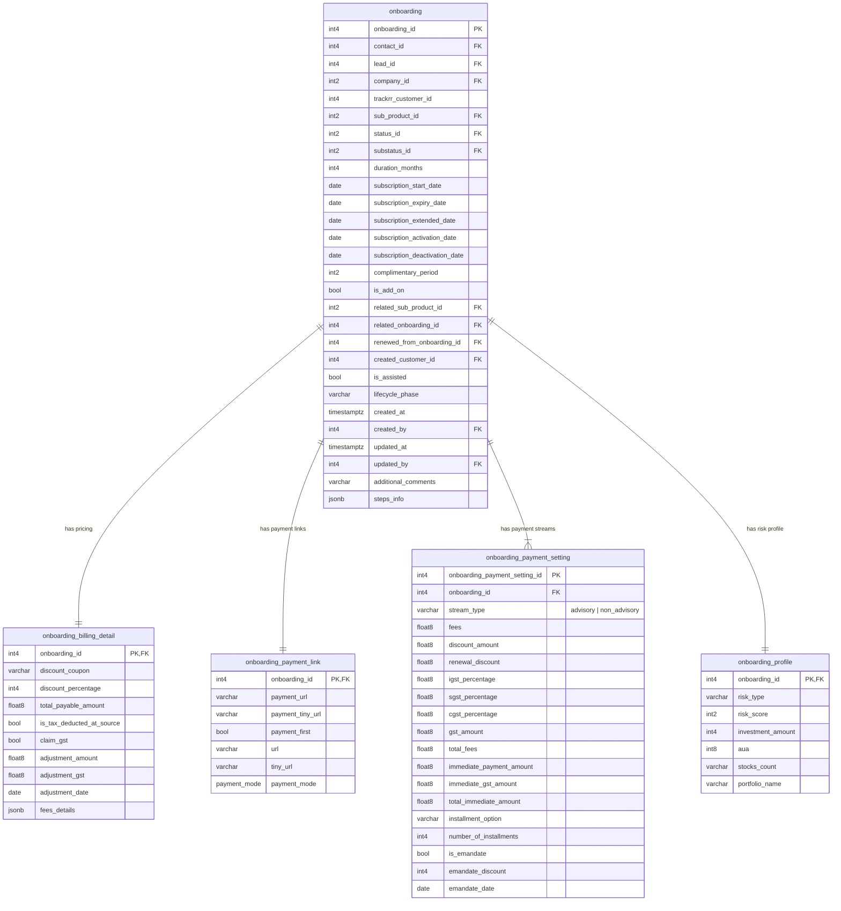

```mermaid
erDiagram
    mst_subproduct ||--|{ mst_subproduct_pricing : "has pricing versions"
    mst_subproduct {
        int4 sub_product_id PK
        int4 product_id FK
        int4 company_id FK
        varchar name
        varchar shortname
        text description
        varchar code
        varchar image_url
        varchar document_url
        varchar video_url
        bool is_add_on
        _int4 related_sub_product_id
        bool is_callcentre_allowed
        _int4 max_complimentary_days
        jsonb max_renewal_complimentary_days
        bool is_visible
        int2 sequence
        bool is_active
        timestamptz created_at
        int4 created_by FK
        timestamptz updated_at
        int4 updated_by FK
        jsonb additional_data
    }
    mst_subproduct_pricing {
        int4 sub_product_pricing_id PK
        int4 sub_product_id FK
        date effective_from
        date effective_to
        float8 advisory_fees
        float8 non_advisory_fees
        float8 igst_percentage
        float8 sgst_percentage
        float8 cgst_percentage
        jsonb advisory_installment_option
        jsonb non_advisory_installment_option
        int4 lumpsum_payment_discount_percentage
        float8 emandate_discount
        int4 first_advisory_payment_amount
        int4 second_advisory_payment_amount
        int4 renewal_advisory_fees
        int4 first_renewal_advisory_fees
        int4 second_renewal_advisory_fees
        int4 first_non_advisory_payment_amount
        varchar max_advisory_discount
        varchar max_non_advisory_discount
        varchar max_renewal_discount
        int4 additional_advisory_discount
        int4 advisory_installment_amount
        int4 non_advisory_installment_amount
        int4 enach_advisory_max_discount
        int4 enach_non_advisory_max_discount
        varchar investment_amount
        int4 services_duration_months
        int4 fees_duration_months
        int4 token_fees
        varchar token_fees_frequency
        bool is_instalment_allowed
        jsonb fees_details
        varchar product_risk
    }
```

# Database Schema Improvement & 3NF Normalization Plan

This document contains structural schema improvement recommendations for the database. It is based on the analysis of `ddl.sql` and `databaseStanderization (1).docx`, with a major focus on normalizing heavy tables (like `onboarding`, `mst_subproduct`, and Call Analysis tables) into **Third Normal Form (3NF)**.

All index-related details are excluded from this analysis.

---

## 1. Third Normal Form (3NF) Normalization for Heavy Tables

A table is in 3NF if it is in 2NF and has **no transitive dependencies** (i.e., non-key columns must depend only on the primary key, and not on other non-key columns). Storing calculated breakdowns, repeating installment groups, and duplicate user attributes violates 3NF and leads to heavy, slow-performing tables.

### A. Normalizing `public.onboarding` (92 columns)

The `onboarding` table contains a massive mix of core contract details, payment URLs, RM organization hierarchies, detailed tax/billing breakdowns, and installment parameters for two distinct product types (Advisory and Non-Advisory).

#### 3NF Anomalies Identified:
1. **Transitive Dependency on `rm_id`**: The columns `location_id`, `department_id`, `team_id`, and `reporting_manager_id` are attributes of the Relationship Manager (`mst_user.user_id`). Copying them here violates 3NF because `onboarding_id` -> `rm_id` -> `location_id`.
2. **Repeating Groups**: Separate sets of identical columns for Advisory and Non-Advisory fees/installments (e.g. `advisory_fees` vs `non_advisory_fees`, `advisory_number_of_installments` vs `non_advisory_number_of_installments`).
3. **Billing Breakdown details**: The detailed tax calculations (CGST, SGST, IGST, immediate payment, total payable) are attributes of a billing invoice rather than the onboarding record itself.

#### Proposed 3NF Normalized Schema:



---

### B. Normalizing `public.mst_subproduct` (55 columns)

`mst_subproduct` is a master catalog table. However, it currently contains all operational pricing rules, installment configurations, and discount limits.

#### 3NF Anomalies Identified:
- **Pricing & Discounts**: Storing fields like `advisory_fees`, `igst_percentage`, `max_advisory_discount`, and `enach_advisory_max_discount` directly in the catalog table prevents price versioning. If the commercial policy changes, the subproduct record must be overwritten or duplicated.

#### Proposed 3NF Normalized Schema:



---

### C. Normalizing Call QA Tables (71 & 59 columns)

`public.sales_call_analysis_by_activity` (71 columns) and `public.lead_analysis` (59 columns) duplicate the same AI-generated QA scoring attributes (sentiment score, compliance score, client persona, red flags, transcript, etc.).

#### 3NF Anomalies Identified:
1. **Redundant Duplicate Tables**: Storing the same call analysis details in two different tables depending on lifecycle stage violates schema normalization.
2. **Transitive Dependency on `rm_id` and `contact_id`**: Storing `rm_name` (depends on `rm_id`) and `customer_name` (depends on `contact_id`) violates 3NF. Names must be fetched via joins, ensuring that updates to a user's name are automatically reflected.

#### Proposed 3NF Normalized Schema:
Merge both tables into a single `activity_call_analysis` table:

```mermaid
erDiagram
    activity_call_analysis {
        int4 id PK
        int4 activity_id FK, UNIQUE
        int4 contact_id FK
        int4 lead_id FK
        int4 rm_id FK
        int4 lead_age
        varchar call_type
        text call_outcome
        jsonb conclusion
        text buying_intent
        jsonb buying_intent_reason
        jsonb suggestions_to_improve_buying_conversion
        text conversation_intent
        text customer_intent_state
        int4 intent_score
        jsonb intent_score_reasoning
        int4 pitch_impact_on_intent
        jsonb pitch_impact_reasoning
        int4 lead_conversion_probability_percent
        varchar lead_conversion_confidence_level
        int4 lead_conversion_time_horizon_days
        json lead_conversion_analysis
        varchar client_persona
        varchar persona_confidence
        jsonb client_persona_analysis
        bool is_rm_identify_customer_persona
        jsonb rm_persona_analysis
        varchar rm_introduction_done
        varchar company_disclosed
        varchar risk_disclosure_done
        varchar no_guaranteed_returns
        varchar client_profiling_done
        varchar suitable_product_pitched
        varchar no_pressure_selling
        varchar professional_language_used
        varchar no_slang_or_casual_street_language_used
        varchar sentiment_overall_tone
        jsonb sentiment_emotional_cues
        int4 sentiment_score
        jsonb sentiment_score_justification
        int4 compliance_score
        jsonb compliance_analysis
        jsonb compliance_score_justification
        int4 call_flow_score
        jsonb call_flow_justification
        jsonb red_flags
        varchar audio_duration
        varchar product_offered
        int4 language_professionalism_score
        text language_professionalism_score_justification
        jsonb language_improvement_suggestions
        jsonb rm_effectiveness
        jsonb recommended_next_actions
        jsonb recommended_next_actions_for_rm
        jsonb recommended_next_actions_for_system
        jsonb rm_coaching_feedback
        jsonb customer_profile
        text transcription
        timestamptz created_at
        jsonb call_type_summary
        varchar ai_lead_status
        jsonb all_summaries
        int4 sentiment_score_based_on_prev
        int4 buying_intent_score_based_on_prev
        int4 lead_conversion_probability_percent_based_on_prev
        int4 compliance_score_based_on_prev
        jsonb reason_for_lead_status
        int4 buying_intent_score
        float8 prompt_tokens
        float8 completion_tokens
        float8 total_tokens
        float8 processing_cost
        float8 processing_time_in_seconds
        jsonb extra
    }
```

---

## 2. Core Schema Cleanups & Type Consistency (Active Tables)

### A. Critical Bug Risk: Audit Columns (`created_by` / `updated_by`) Integer Overflow

In the database, user IDs in the master table (`mst_user.user_id`) are stored as `int4` (integer).
However, in **8 active tables** (16 columns), the audit columns `created_by` and `updated_by` are declared as `int2` (smallint, maximum value of 32,767).

> [!CAUTION]
> As soon as a user with a `user_id` greater than 32,767 creates or updates a record in any of these tables, the database will crash (`22003: numeric value out of range`).

#### Affected Tables:
- `public.contact`, `public.contact_audit`, `public.feedback_response`, `public.mst_role`, `public.mst_screen`, `public.mst_user_stage`, `public.onboarding_detail`, `public.onboarding_detail_audit`.

#### Recommendation:
Change these columns to `int4` to prevent overflow crashes.

---

### B. Core Column Type Mismatches (Implicit Casting Overhead)

| Column | Master Table Definition | Transactional Table Definitions (Mismatches) |
| :--- | :--- | :--- |
| **`company_id`** | `mst_company.company_id` is **`int2`** | **`int4`** in **33 tables** (including `customer`, `call_events`, `onboarding`, `payment`) |
| **`status_id`** | `mst_status.status_id` is **`int4`** | **`int2`** in **15 tables** (including `lead`, `activity`) |
| **`substatus_id`** | `mst_substatus.substatus_id` is **`int4`** | **`int2`** in **15 tables** (including `lead`, `activity`) |
| **`product_id`** | `mst_product.product_id` is **`int4`** | **`int2`** in `lead.product_id` |
| **`reporting_manager_id`** | `mst_user.user_id` is **`int4`** | **`int2`** in `mst_user` (Bug Risk: manager user_id > 32k will crash) |

#### Recommendation:
Standardize columns to match their master definitions to eliminate join casting overhead.

---

### C. Missing Primary Keys in Active Tables

There are **31 active tables** lacking a Primary Key in the DDL. Key examples include:
- `bank_branches`, `banks`, `branch_list`, `branches`, `mst_ifsc`, `mst_pool`, `mst_tag`, `cs_feedback_allocation`, `multiplyrr_upsell_leads_allocation`, `winback_dues`, `kafka_lead_data`.

#### Recommendation:
Add surrogate primary keys (`id serial4 PRIMARY KEY`) or appropriate composite keys to all active tables.

---

### D. Missing Foreign Key Constraints (Referential Integrity)

Only **1 active table** (`lead` self-reference) has an explicit `FOREIGN KEY` constraint. 

> [!WARNING]
> The lack of foreign keys permits orphaned rows (e.g. activity records with invalid `lead_id` or `contact_id`), risking dirty data.

#### Recommendation:
Implement explicit foreign key constraints across active tables.

---

### E. PostgreSQL Features & Specialized Data Types

1. **IP Address (`lead.ip_address`)**: Convert from `varchar(100)` to the native **`inet`** type for automatic validation and storage efficiency.
2. **Indian GSTIN (`contact.gstin`)**: Convert from `varchar(255)` to `char(15)` and add a regex check constraint.
3. **Mixed Timestamps**: Standardize all timestamp columns to **`timestamptz`** (19 columns currently use timezone-less `timestamp`).

---

### F. Denormalization Issues: PostgreSQL Arrays (`_int2`, `_int4`)

The database uses PostgreSQL arrays extensively (46 columns) to store multi-value relations (e.g. `activity.comment_ids _int2`, `lead.sub_product_ids _int4`).

#### Recommendation:
Normalize array fields into standard junction tables (e.g., `lead_subproduct_mapping`) to enforce referential integrity and improve join speeds.

---

### G. Normalization Opportunities (Moving Contact Demographics)

Move demographic details like `organisation_name` and `organisation_additional_info` from the main `contact` table into `contact_demography` to keep the contact table narrow and optimized.

---

### H. Audit Synchronization and Delete Triggers

1. **Schema Sync**: Synchronize missing columns from `contact` and `contact_detail` to `contact_audit` and `contact_detail_audit`.
2. **DELETE Auditing**: Implement `BEFORE DELETE` triggers to capture delete operations in the audit tables.
